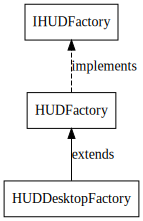

# ADR-29 - Refactor HUD control

## Abstract

Currently, the Kernel controls the UI in Unity, with a component inside Unity named `HUDController`. It has many responsibilities breaking the single responsibility principle, making it challenging to adapt and change. Besides that, the architecture doesn't take into account a way of making the HUDs variables for different platforms.

To deal with those problems, we're going to split those responsibilities and modify the architecture of the `HUDController` to be extendable to different platform implementations, like desktop or mobile, and port the control of the HUD from Kernel to Unity progressively to make Kernel smaller and less responsible.

## Needs

* Remove unnecessary responsibilities from Kernel.
* Split `HUDController` responsibilities.
* Make a `HUD System` extendable to different platform implementations, like desktop or mobile.

## Current implementation

### Kernel and Renderer communication
We have multiple HUDs synced between Kernel and Renderer.

When we start Decentraland Explorer, the Kernel will send a message to Unity to pre-load and show some HUDs that they live in `InitialScene` with a `HUDController` script. Then, the Kernel can hide or show those HUDs as it needs.

### HUDController architecture

`HUDController` is a `MonoBehavior` that lives in the `InitialScene`. It is responsible for creating HUDs, keeping each HUD's lifecycle, reacting to the Kernel messages, and different interconnecting HUDs.

### Approach

Keeping the objectives in mind, we need to create a way to refactor the `HUD System` progressively. Thus, we will divide it into three stages.

#### First stage

This stage's idea is to split the instantiation responsibilities of `HUDController` and make it extendable.

So, to accomplish this goal, the `abstract factory design pattern` will be implemented.

The classes will look like the following:
- `IHUDFactory`: Abstract Factory pattern, to create `HUDs`.
- `HUDFactory`: Default implementation of the `HUDs` factory.
- `HUDController`: It will keep the life cycle of the `HUDs`. It will have the dependency of `IHUDFactory` injected.

Example of extension of the factory:
- `HUDDesktopFactory`: Extended implementation of `HUDFactory` who adds variations of it.

So we can add more implementations depending on each platform. If we want to change the HUD's behaviour completely, you can overwrite how the HUD behaves and shows adding a new implementation of `IHUDFactory`.

#### Second stage

This stage aims to remove the responsibility from the `HUDController` to communicate with the Kernel.

- `IHUDBridge`: Abstract implementation of the communication of the HUD's
- `HUDKernelBridge`: Contains the communication with Kernel.

Example of this system being extendable:

- `HUDDesktopKernelBridge`: Extended implementation of `HUDKernelBridge`.

If we want to have different behaviour against Kernel, we just overwrite/extend the `HUDKernelBridge` class.

#### Third stage

Port the kernel responsibility of managing HUDs to Unity, and maybe implement a HUD's state machine between Kernel and Unity.

We're going to discuss this stage in another ADR.

## Benefit

- Make Kernel smaller and simpler
- Have a way to extend different implementations of the HUD's for each platform

## Participants

- Mateo Miccino
- Brian Amadori
